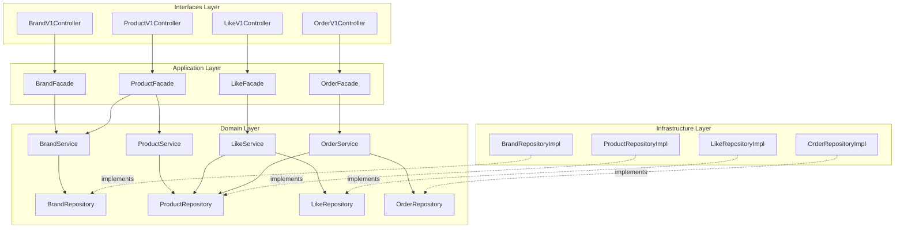
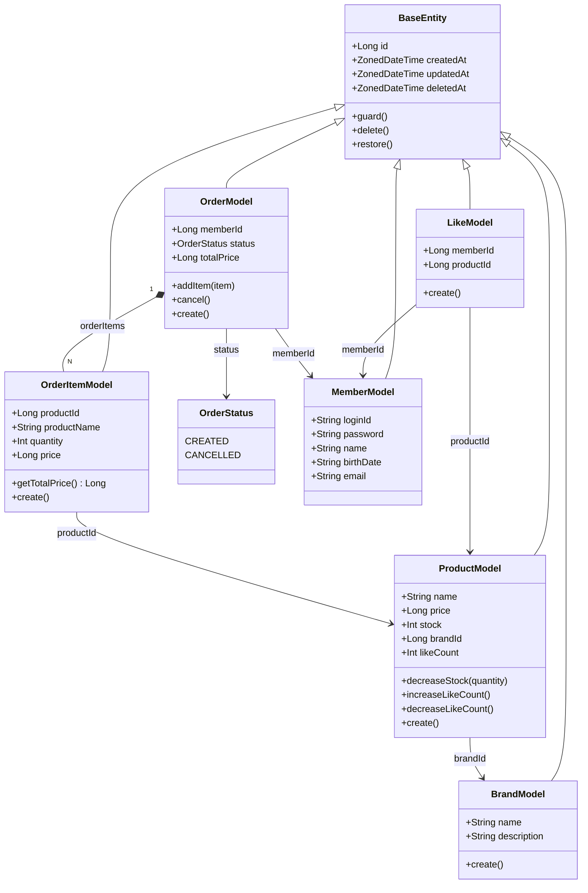
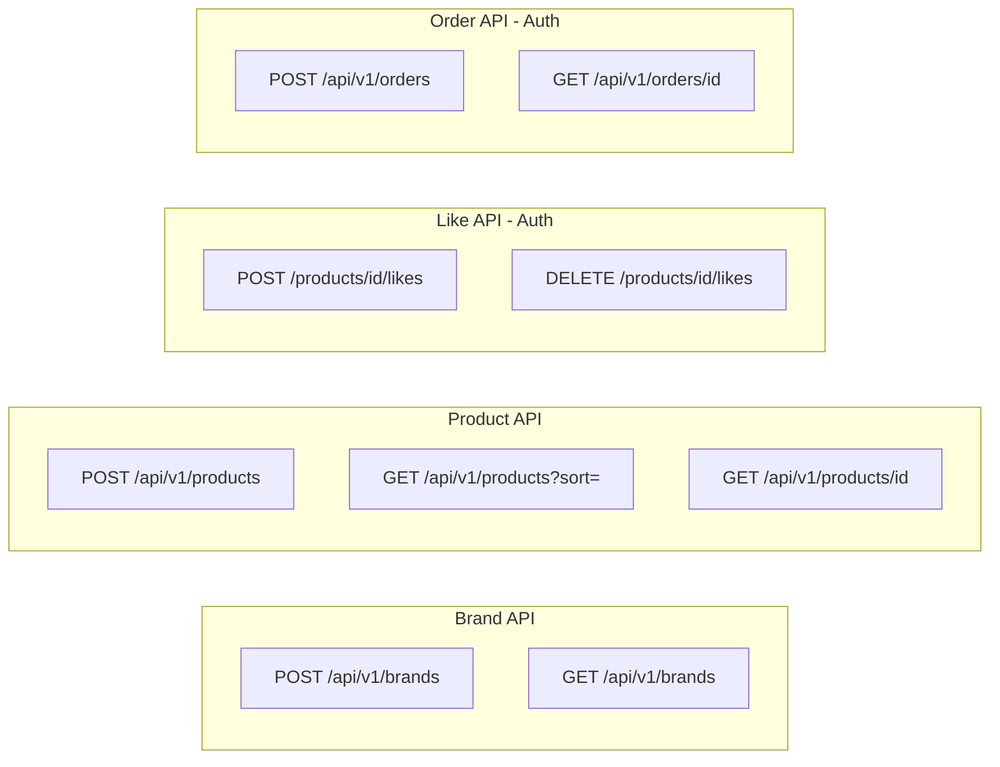
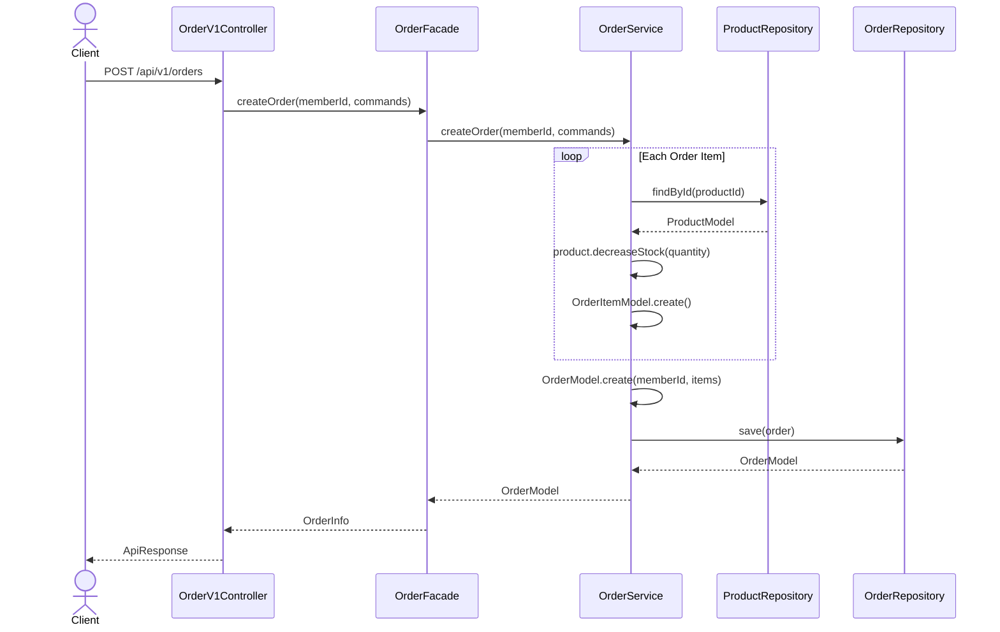
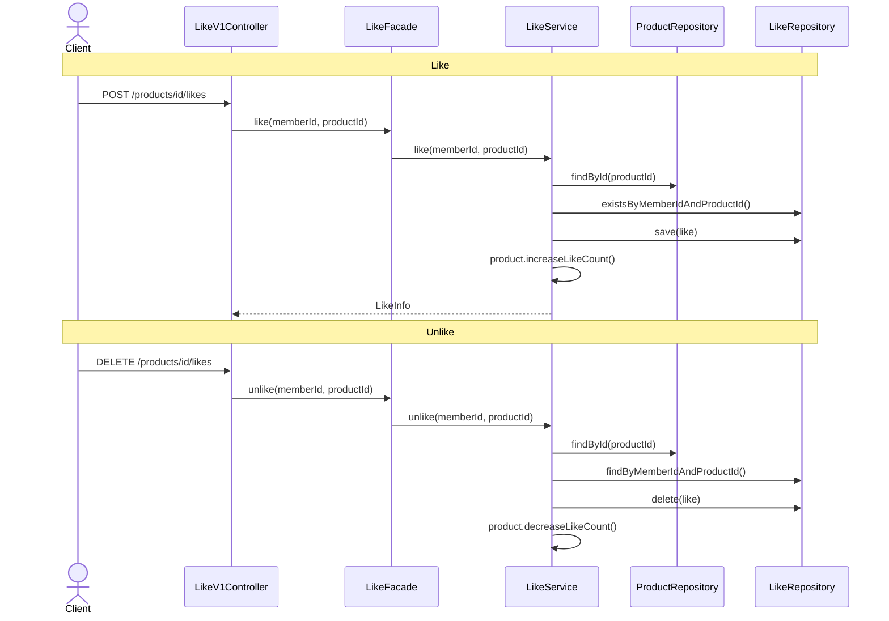
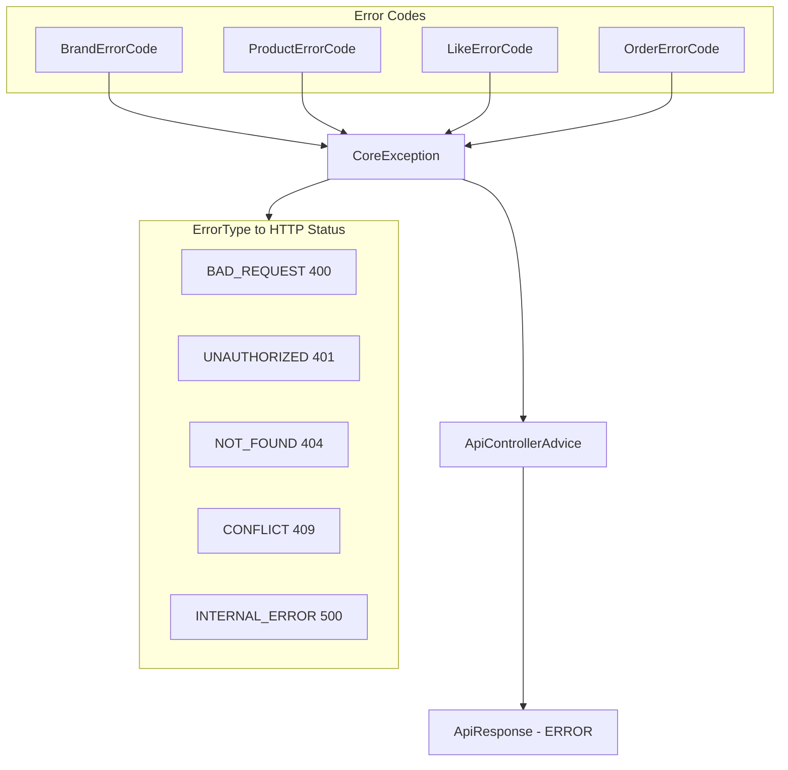

# Commerce API 아키텍처

## 레이어드 아키텍처

```mermaid
graph TB
    subgraph Interfaces["Interfaces Layer"]
        BC[BrandV1Controller]
        PC[ProductV1Controller]
        LC[LikeV1Controller]
        OC[OrderV1Controller]
    end

    subgraph Application["Application Layer"]
        BF[BrandFacade]
        PF[ProductFacade]
        LF[LikeFacade]
        OF[OrderFacade]
    end

    subgraph Domain["Domain Layer"]
        BS[BrandService]
        PS[ProductService]
        LS[LikeService]
        OS[OrderService]
        BR[BrandRepository]
        PR[ProductRepository]
        LR[LikeRepository]
        OR[OrderRepository]
    end

    subgraph Infrastructure["Infrastructure Layer"]
        BRI[BrandRepositoryImpl]
        PRI[ProductRepositoryImpl]
        LRI[LikeRepositoryImpl]
        ORI[OrderRepositoryImpl]
    end

    BC --> BF
    PC --> PF
    LC --> LF
    OC --> OF

    BF --> BS
    PF --> PS
    PF --> BS
    LF --> LS
    OF --> OS

    BS --> BR
    PS --> PR
    LS --> LR
    LS --> PR
    OS --> OR
    OS --> PR

    BRI -.->|implements| BR
    PRI -.->|implements| PR
    LRI -.->|implements| LR
    ORI -.->|implements| OR
```

## 도메인 모델 관계도

```mermaid
classDiagram
    class BaseEntity {
        +Long id
        +ZonedDateTime createdAt
        +ZonedDateTime updatedAt
        +ZonedDateTime deletedAt
        +guard()
        +delete()
        +restore()
    }

    class BrandModel {
        +String name
        +String description
        +create()
    }

    class ProductModel {
        +String name
        +Long price
        +Int stock
        +Long brandId
        +Int likeCount
        +decreaseStock(quantity)
        +increaseLikeCount()
        +decreaseLikeCount()
        +create()
    }

    class LikeModel {
        +Long memberId
        +Long productId
        +create()
    }

    class OrderModel {
        +Long memberId
        +OrderStatus status
        +Long totalPrice
        +addItem(item)
        +cancel()
        +create()
    }

    class OrderItemModel {
        +Long productId
        +String productName
        +Int quantity
        +Long price
        +getTotalPrice() Long
        +create()
    }

    class OrderStatus {
        CREATED
        CANCELLED
    }

    class MemberModel {
        +String loginId
        +String password
        +String name
        +String birthDate
        +String email
    }

    BaseEntity <|-- BrandModel
    BaseEntity <|-- ProductModel
    BaseEntity <|-- LikeModel
    BaseEntity <|-- OrderModel
    BaseEntity <|-- OrderItemModel
    BaseEntity <|-- MemberModel

    ProductModel --> BrandModel : brandId
    LikeModel --> MemberModel : memberId
    LikeModel --> ProductModel : productId
    OrderModel --> MemberModel : memberId
    OrderModel "1" *-- "N" OrderItemModel : orderItems
    OrderItemModel --> ProductModel : productId
    OrderModel --> OrderStatus : status
```

## API 엔드포인트

```mermaid
graph LR
    subgraph Brand["Brand API"]
        B1["POST /api/v1/brands"]
        B2["GET /api/v1/brands"]
    end

    subgraph Product["Product API"]
        P1["POST /api/v1/products"]
        P2["GET /api/v1/products?sort="]
        P3["GET /api/v1/products/id"]
    end

    subgraph Like["Like API - Auth"]
        L1["POST /products/id/likes"]
        L2["DELETE /products/id/likes"]
    end

    subgraph Order["Order API - Auth"]
        O1["POST /api/v1/orders"]
        O2["GET /api/v1/orders/id"]
    end
```

## 주문 생성 흐름

```mermaid
sequenceDiagram
    actor Client
    participant Controller as OrderV1Controller
    participant Facade as OrderFacade
    participant OrderSvc as OrderService
    participant ProductRepo as ProductRepository
    participant OrderRepo as OrderRepository

    Client->>Controller: POST /api/v1/orders
    Controller->>Facade: createOrder(memberId, commands)
    Facade->>OrderSvc: createOrder(memberId, commands)

    loop Each Order Item
        OrderSvc->>ProductRepo: findById(productId)
        ProductRepo-->>OrderSvc: ProductModel
        OrderSvc->>OrderSvc: product.decreaseStock(quantity)
        OrderSvc->>OrderSvc: OrderItemModel.create()
    end

    OrderSvc->>OrderSvc: OrderModel.create(memberId, items)
    OrderSvc->>OrderRepo: save(order)
    OrderRepo-->>OrderSvc: OrderModel
    OrderSvc-->>Facade: OrderModel
    Facade-->>Controller: OrderInfo
    Controller-->>Client: ApiResponse
```

## 좋아요 등록/취소 흐름

```mermaid
sequenceDiagram
    actor Client
    participant Controller as LikeV1Controller
    participant Facade as LikeFacade
    participant LikeSvc as LikeService
    participant ProductRepo as ProductRepository
    participant LikeRepo as LikeRepository

    Note over Client,LikeRepo: Like
    Client->>Controller: POST /products/id/likes
    Controller->>Facade: like(memberId, productId)
    Facade->>LikeSvc: like(memberId, productId)
    LikeSvc->>ProductRepo: findById(productId)
    LikeSvc->>LikeRepo: existsByMemberIdAndProductId()
    LikeSvc->>LikeRepo: save(like)
    LikeSvc->>LikeSvc: product.increaseLikeCount()
    LikeSvc-->>Controller: LikeInfo

    Note over Client,LikeRepo: Unlike
    Client->>Controller: DELETE /products/id/likes
    Controller->>Facade: unlike(memberId, productId)
    Facade->>LikeSvc: unlike(memberId, productId)
    LikeSvc->>ProductRepo: findById(productId)
    LikeSvc->>LikeRepo: findByMemberIdAndProductId()
    LikeSvc->>LikeRepo: delete(like)
    LikeSvc->>LikeSvc: product.decreaseLikeCount()
```

## 예외 처리 전략

```mermaid
graph TB
    subgraph ErrorCodes["Error Codes"]
        BE["BrandErrorCode"]
        PE["ProductErrorCode"]
        LE["LikeErrorCode"]
        OE["OrderErrorCode"]
    end

    subgraph HttpStatus["ErrorType to HTTP Status"]
        BAD["BAD_REQUEST 400"]
        UNA["UNAUTHORIZED 401"]
        NF["NOT_FOUND 404"]
        CON["CONFLICT 409"]
        INT["INTERNAL_ERROR 500"]
    end

    BE --> CE[CoreException]
    PE --> CE
    LE --> CE
    OE --> CE
    CE --> HttpStatus
    CE --> ACA[ApiControllerAdvice]
    ACA --> RES["ApiResponse - ERROR"]
```
