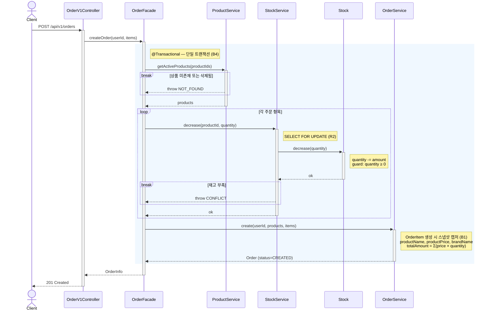
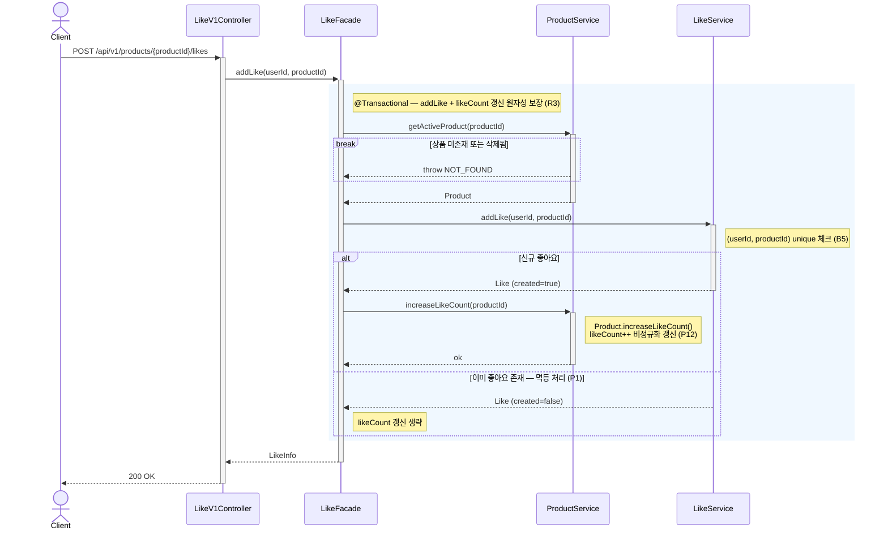
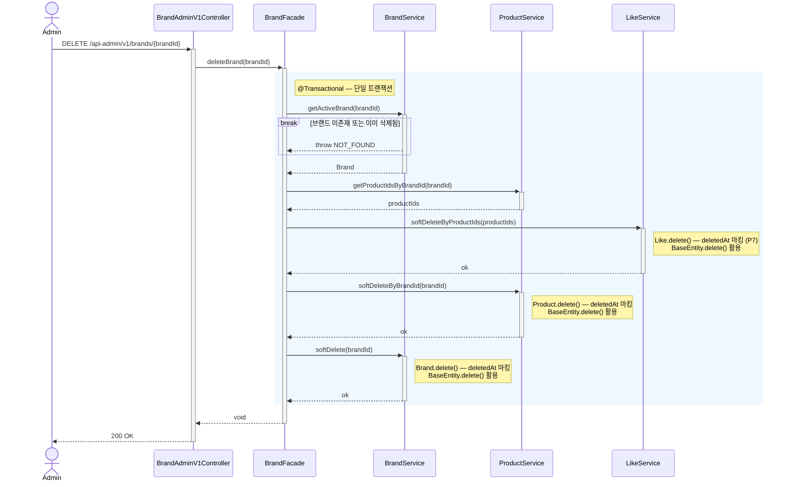

# 02. 시퀀스 다이어그램

> 핵심 유스케이스 3개의 **객체 간 협력 흐름**을 시퀀스 다이어그램으로 표현한다.
>
> **범위:** 주문 생성 · 좋아요 등록 · 브랜드 삭제(어드민)
> **표기:** Mermaid sequenceDiagram · Main Flow 중심 + 핵심 예외 분기
>
> **설계 원칙**
> - Controller→Service→Repository의 관성적 그림이 아니라, **책임 분리/경계/핵심 협력 객체**가 드러나야 설계 문서가 됨
> - 비즈니스 임팩트가 큰 핵심 예외(재고 부족, 품절 등)만 반영. 정상 흐름을 먼저 잡을 것
> - 문서에 How(비즈니스 로직)를 넣으면 갱신이 끝없음. **Why(결정 근거)**를 넣어야 유지 가능
> - 모든 API를 다 그리면 관리 불가 → 크로스 도메인 연동, 복잡한 비즈니스 규칙이 있는 기능 위주로 선정
>
> **문서 유지 원칙**: 큰 작업 완료 시 업데이트하는 방식이 현실적. 개발 속도에 맞춘 실시간 최신화보다는 마일스톤 단위 갱신 권장

**참여자 범례**

| 레이어 | 네이밍 패턴 | 역할 |
|--------|------------|------|
| interfaces.api | `{Entity}V1Controller` / `{Entity}AdminV1Controller` | HTTP 요청·응답 변환 |
| application | `{Entity}Facade` | 크로스 도메인 오케스트레이션, 트랜잭션 경계 |
| domain | `{Entity}Service` | 단일 도메인 비즈니스 로직 |
| domain | `{Entity}Model` | 도메인 엔티티 — 핵심 비즈니스 규칙 보유 |

> Repository 레이어는 Service 내부 구현으로 간주하여 다이어그램에 포함하지 않는다.
> 도메인 엔티티는 비즈니스 규칙이 드러나는 핵심 지점에서만 참여자로 표기한다.
> 추상화 수준은 "코드를 즉시 작성할 수 있을 정도"가 아니라, **조건 분기, 사이드 이펙트, 트랜잭션 경계**가 드러나는 수준을 유지한다.

---

## 1. 주문 생성

### 시퀀스 다이어그램

### 설계 포인트

| 포인트 | 설명 | 근거 |
|--------|------|------|
| 단일 트랜잭션 | 재고 확인·차감·스냅샷·주문 생성을 하나의 트랜잭션으로 묶어 정합성 보장 | B4 |
| 원자적 재고 차감 | Stock 엔티티를 분리하고 비관적 락으로 동시성 제어. `Stock.decrease()` 내부에서 quantity ≥ 0 가드 | B2, R2 |
| 스냅샷 독립 | OrderItem에 주문 시점 상품명·가격·브랜드명을 복사하여 원본 변경에 영향받지 않음 | B1 |
| Facade 오케스트레이션 | OrderFacade가 ProductService·StockService·OrderService를 조율 | 레이어 패턴 |

### 예외 흐름 요약

| 조건 | 응답 | 설명 |
|------|------|------|
| 비로그인 | 401 | 인증 필터에서 차단 |
| 빈 상품 목록 / 수량 < 1 / 수량 > 상한(P13) | 400 | 입력 검증 |
| 동일 상품 중복 포함 | 400 | 수량으로 표현 강제 (P8) |
| 상품 미존재 또는 삭제됨 | 400 | ProductService 검증 |
| 재고 부족 | 409 | Stock.decrease() 가드 실패 |

---

## 2. 좋아요 등록

### 시퀀스 다이어그램

### 설계 포인트

| 포인트 | 설명 | 근거 |
|--------|------|------|
| 멱등성 | 동일 사용자·상품 조합의 중복 요청 시 200 반환, 신규 생성 없음 | P1 |
| 조건부 카운트 갱신 | 신규 생성 시에만 `Product.increaseLikeCount()` 호출 — 멱등 호출에서 카운트가 이중 증가하지 않도록 방어 | P12 |
| 유일성 제약 | (userId, productId) unique constraint로 DB 레벨에서 중복 방지 | B5 |
| 트랜잭션 보장 | addLike와 increaseLikeCount가 하나의 트랜잭션으로 묶여 likeCount 불일치 방지 | R3 |

### 예외 흐름 요약

| 조건 | 응답 | 설명 |
|------|------|------|
| 비로그인 | 401 | 인증 필터에서 차단 |
| 상품 미존재 또는 삭제됨 | 404 | ProductService 검증 |
| 이미 좋아요 상태 | 200 | 멱등 성공 — 에러가 아님 (P1) |

---

## 3. 브랜드 삭제 (어드민)

### 시퀀스 다이어그램

### 설계 포인트

| 포인트 | 설명 | 근거 |
|--------|------|------|
| 연쇄 soft delete 순서 | Like → Product → Brand 순서로 삭제 (의존 관계 역순, 참조 정합성 유지) | P7 |
| 좋아요 soft delete | 사용자 직접 취소(물리 삭제)와 달리, 시스템 연쇄 삭제는 soft delete로 복구 가능성 보존 | P6, P7 |
| BaseEntity.delete() | 모든 soft delete 대상 엔티티가 BaseEntity의 `delete()` 메서드를 통해 deletedAt을 마킹 — 도메인 모델에 삭제 책임이 존재 | 레이어 패턴 |
| 스냅샷 독립 | 기존 주문의 OrderItem 스냅샷은 원본 삭제에 영향받지 않음 — 별도 처리 불필요 | B1 |
| Facade 오케스트레이션 | BrandFacade가 3개 도메인 서비스를 조율하여 크로스 도메인 의존성 관리 | 레이어 패턴 |
| 복구 시 likeCount 재계산 필요 | 브랜드/상품 복구(restore) 시나리오가 추가되면, soft delete된 Like 수와 Product.likeCount가 불일치할 수 있어 재계산 로직 필요 | R3, P12 |

### 예외 흐름 요약

| 조건 | 응답 | 설명 |
|------|------|------|
| 브랜드 미존재 | 404 | BrandService 검증 |
| 이미 삭제된 브랜드 | 404 | 삭제된 엔티티는 불변 취급 (P11) |
| 소속 상품 없음 | 200 | 정상 처리 — 브랜드만 삭제 |
