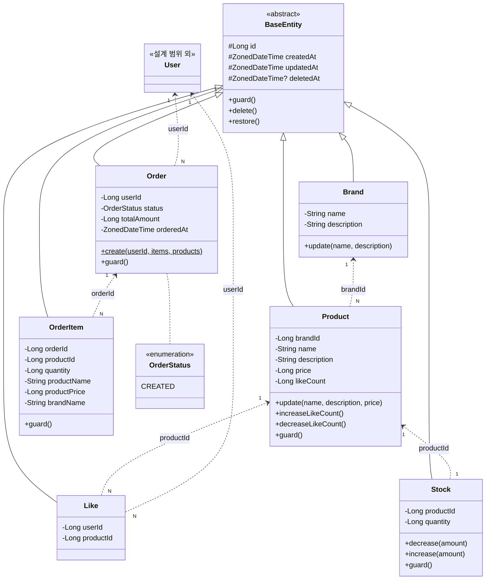

# 03. 클래스 다이어그램

> **도메인 객체의 구조와 책임**을 클래스 다이어그램과 상세 설명으로 표현한다.
>
> **설계 원칙**
> - 엔티티/VO 분리 기준: ID 존재 여부와 생명 주기 — 현재 도메인은 모두 독립 생명 주기를 가지므로 VO 없이 엔티티로 설계
> - 연관 관계: **단방향 기본**, 양방향 최소화 — 모든 관계를 ID 참조(단방향)로 표현
> - 비즈니스 책임은 **도메인 객체에 포함** — Service에 로직이 집중되지 않도록 엔티티에 메서드 배치
> - 기존 코드 패턴(BaseEntity, `protected set`, `init{}` 검증, CoreException) 준수
>
> **보강 원칙**
> - **VO 분리 판단 기준**: ① 도메인 관점 — 이 값이 독립적인 의미 단위인가? ② 실용적 관점 — 지금 분리할 실익(상태 변환/비교/독립 사용)이 있는가? ①만 충족이면 보류, ①+② 모두 충족이면 VO로 분리. 현재 도메인의 price(Long), quantity(Long) 등은 ①만 충족하여 원시 타입으로 유지
> - **도메인 서비스 ≠ @Service**: Repository 의존이 있으면 애플리케이션 서비스. 도메인 서비스는 도메인 레이어에 속하며 Repository가 없다. 현재 프로젝트의 `{Entity}Service`는 Repository를 사용하므로 애플리케이션 서비스, Facade는 크로스 도메인 오케스트레이터
> - **검증 책임 분리**: Controller → 데이터 유효성(`@Valid`), Application → not found/유효하지 않은 조회, Domain → 비즈니스 규칙(핵심 불변식). 본 설계에서 `init{}`/`guard()`는 Domain 검증에 해당

---

## 1. 도메인 모델 전체 구조

### 클래스 다이어그램

> **Mermaid 표기 범례**: 메서드 뒤의 `$`는 static(Kotlin companion object) 메서드를 의미한다. (예: `Order.create()$` = 팩토리 메서드)

### 관계 요약

| 관계 | 방향 | 카디널리티 | 참조 방식 | 설명 |
|------|------|-----------|-----------|------|
| Brand → Product | 단방향 | 1:N | Product.brandId | 브랜드 삭제 시 소속 상품 연쇄 soft delete |
| Product → Stock | 단방향 | 1:1 | Stock.productId | 재고를 별도 엔티티로 분리하여 동시성 제어 (B2, R2) |
| Product → Like | 단방향 | 1:N | Like.productId | (userId, productId) unique constraint (B5) |
| Order → OrderItem | 단방향 | 1:N | OrderItem.orderId | OrderItem에 주문 시점 스냅샷 저장 (B1) |
| *(범위 외)* User → Like | 단방향 | 1:N | Like.userId | 사용자별 좋아요 목록 조회에 사용 |
| *(범위 외)* User → Order | 단방향 | 1:N | Order.userId | 사용자별 주문 목록 조회에 사용 |

> **모든 관계는 ID 참조(단방향)**로 표현한다. JPA 연관 매핑(`@ManyToOne` 등)은 사용하지 않고,
> 서비스 레이어에서 ID를 통해 조회하는 방식으로 결합도를 최소화한다.
> User 엔티티는 1주차 완료 전제로 설계 범위에서 제외하되, Like·Order가 userId를 외부 참조하는 관계만 표기한다.

---

## 2. BaseEntity

> 기존 코드: `modules/jpa/.../BaseEntity.kt`

| 속성 | 타입 | 제약 | 설명 |
|------|------|------|------|
| id | Long | PK, AUTO_INCREMENT | 엔티티 식별자 |
| createdAt | ZonedDateTime | NOT NULL, 생성 시 자동 | 생성 시점 |
| updatedAt | ZonedDateTime | NOT NULL, 변경 시 자동 | 최종 수정 시점 |
| deletedAt | ZonedDateTime? | nullable | soft delete 시점 (null이면 활성) |

| 메서드 | 설명 |
|--------|------|
| `guard()` | `@PrePersist`, `@PreUpdate` 시점에 호출되는 유효성 검증 훅. 하위 클래스에서 override |
| `delete()` | `deletedAt = now()` — 멱등 (이미 삭제된 경우 무시) |
| `restore()` | `deletedAt = null` — 멱등 (삭제되지 않은 경우 무시) |

- `@MappedSuperclass`로 모든 도메인 엔티티가 상속
- `prePersist()` / `preUpdate()`에서 `guard()` 호출 후 타임스탬프 자동 관리
- `protected set`으로 외부에서 직접 수정 불가

> **deletedAt과 soft delete 미사용 엔티티의 트레이드오프**:
> Stock, Order, OrderItem은 soft delete를 사용하지 않지만(P6), BaseEntity를 상속하므로 `deletedAt` 컬럼이 DB에 존재하게 된다.
> 이는 모든 엔티티에 일관된 베이스 구조(id, createdAt, updatedAt)를 제공하기 위한 트레이드오프로,
> 해당 엔티티에서는 **deletedAt을 null로 유지하며 사용하지 않는다**.
> 향후 엔티티 수가 증가하여 트레이드오프가 부담이 되면, `BaseTimeEntity`(id, createdAt, updatedAt만 포함)를 분리하는 방안을 검토할 수 있다.

---

## 3. 브랜드 (Brand)

| 속성 | 타입 | 제약 | 설명 |
|------|------|------|------|
| name | String | NOT NULL, UNIQUE, blank 불가 | 브랜드명 (중복 불가) |
| description | String | NOT NULL, blank 불가 | 브랜드 설명 |

| 메서드 | 시그니처 | 설명 |
|--------|----------|------|
| 생성자 검증 | `init {}` | name, description blank 검증 → `CoreException(BAD_REQUEST)` |
| 수정 | `update(name, description)` | 필드 갱신 + blank 검증 |

**설계 근거**

- 브랜드명 UNIQUE 제약은 동일 이름 브랜드의 사용자 혼란 방지를 위한 자체 추가 제약
- soft delete 대상 — 삭제 시 `BaseEntity.delete()` 활용, 어드민 API에서 삭제된 브랜드도 조회 가능 (P10)
- 삭제된 브랜드에 대한 수정/재삭제는 404 처리 (P11)

---

## 4. 상품 (Product) & 재고 (Stock)

### 4.1 Product

| 속성 | 타입 | 제약 | 설명 |
|------|------|------|------|
| brandId | Long | NOT NULL | 소속 브랜드 ID (FK 역할, 변경 불가) |
| name | String | NOT NULL, blank 불가 | 상품명 |
| description | String | NOT NULL, blank 불가 | 상품 설명 |
| price | Long | NOT NULL, > 0 | 상품 가격 (원 단위) |
| likeCount | Long | NOT NULL, ≥ 0, 기본값 0 | 좋아요 수 비정규화 필드 (P12) |

| 메서드 | 시그니처 | 설명 |
|--------|----------|------|
| 생성자 검증 | `init {}` | name/description blank, price > 0 검증 |
| 수정 | `update(name, description, price)` | 필드 갱신 + 검증. brandId는 수정 불가 |
| 좋아요 증가 | `increaseLikeCount()` | `likeCount++` — 좋아요 등록 시 호출 (P12) |
| 좋아요 감소 | `decreaseLikeCount()` | `likeCount == 0`이면 `CoreException(CONFLICT, "좋아요 수가 0 미만이 될 수 없습니다")` → 아니면 `likeCount--` (P12) |
| 유효성 검증 | `guard()` | `@PrePersist`/`@PreUpdate` 시 price > 0, likeCount ≥ 0 검증 |

**설계 근거**

- `likeCount` 비정규화: 좋아요 수 기반 정렬(`likes_desc`)의 쿼리 성능을 위해 Product에 직접 관리 (P12)
- `increaseLikeCount()` / `decreaseLikeCount()`를 엔티티 메서드로 배치하여 비즈니스 규칙(≥ 0 가드)을 도메인에 위임
- **이중 검증 전략** (Stock과 동일): `decreaseLikeCount()` 내부에서 `likeCount == 0` **사전 검증**을 수행하여 의미 있는 에러 메시지를 즉시 반환하고, `guard()` override로 `@PrePersist`/`@PreUpdate` 시점에 **방어적 후행 검증**(`likeCount ≥ 0`)을 추가하여 어떤 경로로 변경되더라도 음수 방지를 보장
- brandId 변경 불가: 생성 시점에 결정된 브랜드 소속은 불변
- **likeCount 동시성 트레이드오프**: Stock은 주문(재고 차감)의 높은 동시성 압박으로 별도 엔티티로 분리(B2)했으나, likeCount는 주문에 비해 동시성 압박이 낮고 비정규화 캐시 성격이므로 현재 단계에서는 Product에 포함한다. 동시성 이슈가 관측되면 별도 엔티티(예: ProductLikeCount) 분리를 검토한다

### 4.2 Stock

| 속성 | 타입 | 제약 | 설명 |
|------|------|------|------|
| productId | Long | NOT NULL, UNIQUE | 대상 상품 ID (1:1) |
| quantity | Long | NOT NULL, ≥ 0 | 판매 가능 수량 |

| 메서드 | 시그니처 | 설명 |
|--------|----------|------|
| 생성자 검증 | `init {}` | quantity ≥ 0 검증 → `CoreException(BAD_REQUEST)` |
| 차감 | `decrease(amount)` | amount > 0 검증 후 `quantity -= amount` → 결과가 음수이면 `CoreException(CONFLICT, "재고 부족")` |
| 증가 | `increase(amount)` | amount > 0 검증 후 `quantity += amount` — 향후 주문 취소 시 복원용 (E3) |
| 유효성 검증 | `guard()` | `@PrePersist`/`@PreUpdate` 시 `quantity ≥ 0` 검증 — 최후 안전망 |

**분리 근거 (B2, R2)**

- Product 엔티티와 분리하여 **재고 변경 시 Product 전체에 lock이 걸리지 않도록** 함
- 동시 주문 시 `SELECT FOR UPDATE`로 Stock 행만 비관적 락 → Product 조회에 영향 없음
- soft delete 미적용: Product에 종속되며 별도 삭제 시나리오 없음 (P6). BaseEntity 상속으로 deletedAt 컬럼은 존재하나 null로 유지

> **브랜드/상품 삭제 시 Stock 처리**:
> Product가 soft delete되면 Stock 레코드는 DB에 남지만(`deletedAt=null`), 서비스 레이어에서 Product의 활성 여부를
> 먼저 확인하므로 고아 Stock에 접근할 경로가 없다. Stock을 별도로 삭제하지 않는 이유는:
> (1) Stock은 soft delete 미적용 대상이라 `delete()` 호출이 의미상 부적합,
> (2) 상품 복구(restore) 시 Stock을 재생성할 필요 없이 기존 데이터를 그대로 활용 가능,
> (3) 물리 삭제 시 복구 경로가 차단됨.
> 따라서 **Product soft delete 시 Stock은 그대로 유지**하되, 조회 경로가 차단되어 사실상 비활성 상태가 된다.

> **이중 검증 전략**: `decrease()` / `increase()` 메서드 내에서 **사전 검증**(amount > 0, 차감 후 quantity ≥ 0)을 수행하여
> 의미 있는 에러 메시지("재고 부족")를 즉시 반환하고, `guard()` override로 `@PrePersist`/`@PreUpdate` 시점에
> **방어적 후행 검증**을 추가하여 어떤 경로로 quantity가 변경되더라도 음수 방지를 보장한다.

> **Stock 생성 시점**: Stock은 어드민 상품 등록(`POST /api-admin/v1/products`) 시 Product와 함께 생성된다.
> 초기 quantity는 상품 등록 요청에 포함된 값을 사용하며, 서비스 레이어(AdminFacade 또는 ProductService)에서
> Product 저장 후 productId를 확보하여 Stock을 생성·저장한다.
> Product와 Stock의 생성이 하나의 트랜잭션 안에서 이루어져야 하며,
> Stock 없는 Product가 존재하지 않도록 보장한다.

> **어드민 재고 수동 조정**: 현재 spec에는 어드민이 재고를 수동으로 조정하는 API가 포함되지 않는다.
> 따라서 재고는 **상품 등록 시 초기 설정 + 주문 차감**으로만 변동되며, `Stock.increase()`는 향후 주문 취소(E3) 시 복원 용도로만 사용된다.
> 어드민 재고 조정이 필요할 경우 별도 API 추가를 검토한다.

---

## 5. 좋아요 (Like)

| 속성 | 타입 | 제약 | 설명 |
|------|------|------|------|
| userId | Long | NOT NULL | 좋아요한 사용자 ID |
| productId | Long | NOT NULL | 좋아요 대상 상품 ID |
| (deletedAt) | ZonedDateTime? | (BaseEntity 상속) | 연쇄 삭제 시에만 사용 |

| 메서드 | 시그니처 | 설명 |
|--------|----------|------|
| 생성자 검증 | `init {}` | userId, productId 값 검증 → `CoreException(BAD_REQUEST)` |

**비즈니스 메서드 부재에 대한 설명**

- 설계 원칙이 "비즈니스 책임은 도메인 객체에 포함"이지만, Like는 **User-Product 간 관계를 기록하는 관계 엔티티**로서 자체적인 상태 변경이나 비즈니스 규칙이 없다
- 좋아요의 핵심 비즈니스 규칙(유일성 제약, likeCount 갱신)은 각각 DB 제약조건과 Product 엔티티에 위임되어 있음
- 삭제 행위는 BaseEntity의 `delete()`(연쇄 삭제 시)를 상속받아 처리하므로 Like 고유 메서드가 불필요
- **"모든 엔티티에 비즈니스 메서드가 있어야 한다"는 의미가 아니라**, 비즈니스 로직이 존재하는 엔티티에서 해당 로직을 Service가 아닌 엔티티에 배치해야 한다는 원칙임

**유일성 제약 (B5)**

- `(userId, productId)` unique constraint로 DB 레벨 중복 방지
- 대리키(id) + unique constraint 조합 — JPA 매핑 단순화, 일관된 id 기반 설계

**삭제 이원화 (P6, P7)**

| 삭제 시나리오 | 방식 | 이유 |
|--------------|------|------|
| 사용자 직접 취소 | **물리 삭제** (hard delete) | 사용자 의지에 의한 취소 → 복구 대상 아님 |
| 브랜드/상품 연쇄 삭제 | **soft delete** (deletedAt 마킹) | 시스템 연쇄 삭제 → 복구 가능성 보존 |

- Like 엔티티에 `deletedAt`(BaseEntity 상속)을 포함하되, 사용자 취소 시에는 레코드 자체를 제거
- 연쇄 삭제 시에는 `BaseEntity.delete()`를 호출하여 deletedAt만 마킹

---

## 6. 주문 (Order) & 주문 항목 (OrderItem)

### 6.1 Order

| 속성 | 타입 | 제약 | 설명 |
|------|------|------|------|
| userId | Long | NOT NULL | 주문자 ID |
| status | OrderStatus | NOT NULL, 기본값 CREATED | 주문 상태 |
| totalAmount | Long | NOT NULL, > 0 | 주문 총액 = Σ(productPrice × quantity) |
| orderedAt | ZonedDateTime | NOT NULL | 주문 시점 |

| 메서드 | 시그니처 | 설명 |
|--------|----------|------|
| 생성 | `create(userId, items, products)` | 팩토리 메서드 — OrderItem 생성 + 스냅샷 캡처 + totalAmount 계산을 캡슐화 |
| 유효성 검증 | `guard()` | `@PrePersist`/`@PreUpdate` 시 totalAmount > 0 검증 — 정상 주문은 최소 1개 이상의 OrderItem(productPrice > 0, quantity ≥ 1)을 포함하므로 항상 양수 |

**설계 근거**

- `create()` 팩토리 메서드에서 totalAmount = Σ(productPrice × quantity) 계산을 수행하여, 주문 생성의 핵심 규칙을 도메인에 위임
- **팩토리 메서드 흐름**: `create()`는 Order와 `List<OrderItem>`을 함께 생성하여 `Pair<Order, List<OrderItem>>`으로 반환한다. OrderItem의 `orderId`는 이 시점에서 미확정(0)이며, 서비스 레이어에서 Order를 먼저 persist하여 id를 확보한 뒤, 각 OrderItem에 `orderId`를 설정하고 저장한다. 이 방식은 도메인 모델이 스냅샷 캡처와 총액 계산의 핵심 규칙을 보유하면서, id 할당이라는 인프라 관심사는 서비스에 위임하는 구조이다
- 현재 `CREATED` 상태만 존재하여 상태 전이 메서드는 미구현. 결제 연동 시 `changeStatus()` 등의 상태 전이 메서드 추가 예정 (E1)
- soft delete 미적용: 주문은 삭제하지 않고 **상태(status)로 관리** (P6). BaseEntity 상속으로 deletedAt 컬럼은 존재하나 null로 유지
- **orderedAt과 createdAt 분리 근거**: `orderedAt`은 비즈니스적 주문 시점, `createdAt`(BaseEntity 상속)은 시스템 엔티티 생성 시점이다. 현재는 동일하지만, 향후 주문 데이터 마이그레이션·배치 처리·주문 목록 기간 조회(`startAt`/`endAt`) 등에서 비즈니스 시점을 명시적으로 참조할 수 있도록 분리한다. 기간 조회의 기준 필드는 `orderedAt`이다

### 6.2 OrderItem

| 속성 | 타입 | 제약 | 설명 |
|------|------|------|------|
| orderId | Long | NOT NULL | 소속 주문 ID |
| productId | Long | NOT NULL | 원본 상품 ID (참조용) |
| quantity | Long | NOT NULL, ≥ 1 | 주문 수량 |
| productName | String | NOT NULL | 주문 시점 상품명 **(스냅샷)** |
| productPrice | Long | NOT NULL | 주문 시점 상품 가격 **(스냅샷)** |
| brandName | String | NOT NULL | 주문 시점 브랜드명 **(스냅샷)** |

| 메서드 | 시그니처 | 설명 |
|--------|----------|------|
| 생성자 검증 | `init {}` | quantity ≥ 1, productName blank 불가, productPrice > 0, brandName blank 불가 검증 → `CoreException(BAD_REQUEST)` |
| 유효성 검증 | `guard()` | `@PrePersist`/`@PreUpdate` 시 quantity ≥ 1, productPrice > 0 검증 — 이중 검증 전략 일관 적용 |

**스냅샷 설계 (B1)**

- 주문 시점의 상품명, 가격, 브랜드명을 OrderItem에 복사하여 **원본 변경에 영향받지 않음**
- 스냅샷 범위는 주문 내역 표시에 필요한 최소 정보로 한정 (B1: 선택지 A)
- 원본 상품이 삭제되어도 기존 주문의 스냅샷은 독립적으로 유지
- **brandId 미포함 근거**: OrderItem에 `productId`(원본 참조용)는 포함하되, `brandId`는 포함하지 않는다. 브랜드 정보는 `brandName` 스냅샷으로 주문 내역 표시에 충분하며, 브랜드별 주문 통계가 필요할 경우 `productId → Product → brandId` 경로 또는 별도 집계 테이블로 해결 가능하다. 스냅샷 범위는 "주문 내역 표시에 필요한 최소 정보"(B1: 선택지 A) 원칙에 따라 한정한다
- soft delete 미적용: Order에 종속되며 별도 삭제 시나리오 없음 (P6). BaseEntity 상속으로 deletedAt 컬럼은 존재하나 null로 유지

### 6.3 OrderStatus

| 값 | 설명 |
|----|------|
| CREATED | 주문 생성됨 (현재 단계의 유일한 상태) |

- 결제 미구현 현재 단계에서는 `CREATED`만 존재
- 향후 확장: `CREATED → PAID → SHIPPED → COMPLETED → CANCELLED` 등의 상태 전이 추가 (E1)
- enum으로 정의하여 타입 안전성 확보

---

## 7. 설계 결정 요약

| 가이드 원칙 | 적용 | 근거 |
|-------------|------|------|
| 엔티티/VO 분리: ID 존재 여부, 생명 주기 | 모든 도메인 객체를 엔티티로 설계, VO 미적용 | 현재 도메인의 모든 객체가 독립 생명 주기와 ID를 가짐. 가격(price)을 VO로 분리할 수 있으나, 단일 Long 필드이므로 과도한 추상화 회피 |
| 연관 관계: 단방향 기본, 양방향 최소화 | 모든 관계를 ID 참조(단방향)로 표현 | JPA 연관 매핑 없이 서비스 레이어에서 ID 기반 조회. 양방향 의존 없음 |
| 비즈니스 책임은 도메인 객체에 포함 | `Stock.decrease()`, `Product.increaseLikeCount()`, `Order.create()` 등 엔티티에 배치 | Service에 로직이 집중되지 않도록 핵심 규칙을 도메인 모델이 보유 |
| 한 객체에 책임이 몰리지 않았는가? | Stock 분리, OrderItem 스냅샷 분리 | Product에 재고+좋아요+상품정보가 집중되지 않도록 Stock 별도 엔티티로 분리 (B2) |
| 브랜드/상품 삭제 시 Stock 처리 | Product soft delete 시 Stock은 그대로 유지 (조회 경로 차단으로 비활성화) | Stock은 soft delete 미적용 대상이며, 상품 복구 시 재생성 없이 기존 데이터 활용 가능 |
| 이중 검증 전략 일관성 | Stock.decrease()와 Product.decreaseLikeCount() 모두 사전 검증 + guard() 후행 검증 적용 | 의미 있는 에러 메시지 즉시 반환 + 어떤 경로로든 음수 방지 보장 |
| VO를 테이블처럼 다루지 않기 | VO 미사용으로 해당 없음 | 현재 규모에서 VO 도입 시 복잡도만 증가. 향후 필요 시 도입 |
| Service에 모든 로직 집중 회피 | `guard()` override, `init{}` 검증, 엔티티 비즈니스 메서드 | 기존 코드 패턴(ExampleModel) 준수. 검증·상태 변경 로직을 엔티티가 담당 |
| 모든 필드를 객체로 표현하지 않기 | price(Long), quantity(Long) 등 원시 타입 유지 | 단일 값 필드를 VO로 감싸면 과도한 복잡도. 실질적 이점 없는 추상화 회피 |
| Stock 생성 시점 | 상품 등록 시 Product와 함께 단일 트랜잭션으로 생성. 초기 quantity는 등록 요청 값 사용 | Stock 없는 Product가 존재하지 않도록 보장. Product 저장 후 productId 확보하여 Stock 생성 |
| orderedAt과 createdAt 분리 | Order에 비즈니스 시점(orderedAt)을 별도 보유. 기간 조회 기준 필드는 orderedAt | 시스템 시점(createdAt)과 비즈니스 시점을 분리하여, 마이그레이션·배치 등에서도 비즈니스 시점을 명시적으로 참조 가능 |
| BaseEntity 상속 일관성 | 모든 엔티티가 BaseEntity 상속. soft delete 미사용 엔티티(Stock, Order, OrderItem)는 deletedAt을 null로 유지 | 일관된 베이스 구조(id, createdAt, updatedAt) 제공을 위한 트레이드오프. 불필요한 deletedAt 컬럼이 존재하지만, 엔티티 수가 적은 현재 규모에서는 별도 BaseTimeEntity 분리보다 단순성이 유리 |
| likeCount 동시성 트레이드오프 | likeCount를 Product에 포함. 별도 엔티티로 분리하지 않음 | Stock과 달리 좋아요는 주문 대비 동시성 압박이 낮고 비정규화 캐시 성격이므로 현재 단계에서는 Product에 포함. 동시성 이슈 관측 시 별도 엔티티 분리 검토 |
| OrderItem 이중 검증 | OrderItem에도 `init {}` 생성자 검증 + `guard()` 후행 검증 적용 | Order.create() 팩토리에서 생성되어 직접 수정 시나리오가 없지만, 이중 검증 전략의 일관성을 위해 quantity ≥ 1, productPrice > 0 등을 방어적으로 검증 |
| 생성자 검증(init{}) 일관 적용 | 모든 엔티티(Brand, Product, Stock, Like, OrderItem)에 `init {}` 생성자 검증 명시 | ExampleModel 패턴(`init {}` + `CoreException(BAD_REQUEST)`)을 일관 적용하여 객체 생성 시점에 즉시 유효성 검증. `guard()`의 `@PrePersist` 검증과 함께 이중 안전망 구성 |
| 어드민 재고 수동 조정 경로 | 현재 spec에 어드민 재고 조정 API 미포함. 재고는 상품 등록 시 초기 설정 + 주문 차감으로만 변동 | spec 범위 내에서는 `Stock.increase()`가 주문 취소(E3) 시 복원 용도로만 사용. 수동 조정 필요 시 별도 API 추가 검토 |
| Order.guard() totalAmount > 0 | totalAmount 제약을 `≥ 0`에서 `> 0`으로 강화 | 정상적인 주문은 최소 1개 이상의 OrderItem(productPrice > 0, quantity ≥ 1)을 포함하므로 totalAmount는 항상 양수. 빈 주문 목록은 상위 입력 검증에서 차단됨 |
| Mermaid `$` 표기 범례 | Mermaid 다이어그램 하단에 `$` = static(companion object) 메서드 범례 추가 | 다이어그램만 참조하는 독자를 위해 `Order.create()$` 등의 표기 의미를 명확화 |
| VO 미적용 판단 | price, quantity 등 원시 타입 유지, VO 미도입 | VO 판단 기준 "도메인 관점(독립 의미 단위?) + 실용적 관점(분리 실익?)"에서 현재 ①만 충족. 핵심 규칙이 있는 값(예: Password)부터 선택 적용하되, 현재 도메인에는 해당 없음 |
| 도메인 서비스 vs 애플리케이션 서비스 | `{Entity}Service`는 Repository 의존 → 애플리케이션 서비스. Facade는 크로스 도메인 오케스트레이터 | "Repo가 있으면 애플리케이션 서비스, 도메인 서비스는 Repo가 없다" 원칙에 따라 레이어 역할 명확화 |
| 검증 책임 분리 | `init{}`/`guard()`는 Domain 검증, not found/soft delete 접근은 Application 검증 | "Controller=데이터 유효성, Application=조회 검증, Domain=비즈니스 불변식" 원칙 적용 |
