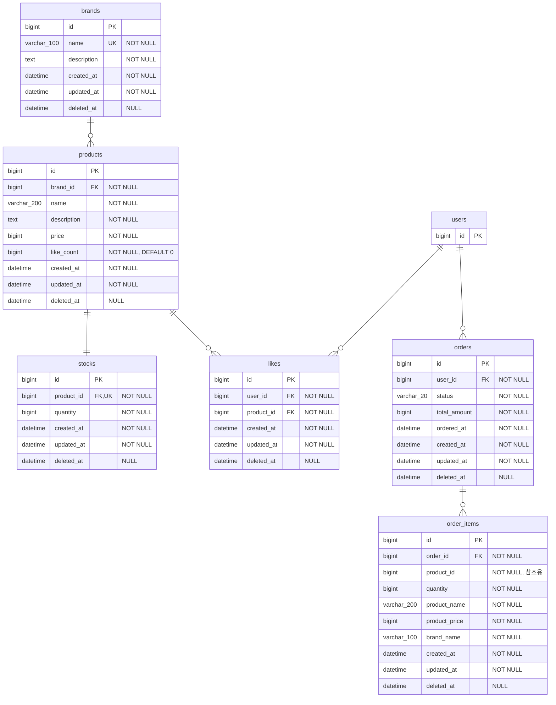

# 04. ERD

> 도메인 모델을 **MySQL 8.0 물리 테이블**로 매핑하고,
> 인덱스 전략, soft delete 정책, 제약조건을 포함한 데이터 설계를 정의한다.
>
> **DB 환경**: MySQL 8.0, utf8mb4, UTC 타임존
> **ORM**: Spring Data JPA (Jakarta) + QueryDSL
> **ID 전략**: `GenerationType.IDENTITY` (AUTO_INCREMENT)
> **테이블 네이밍**: plural (e.g. `brands`, `products`)
>
> **ERD 설계 원칙**
> - **FK는 비용 대비 필요할 때** 설정. 성능·운영·변경 비용이 될 수 있음. 무조건 FK가 기본값이 아님
> - **DB 제약을 최후 방어선으로 활용** — UNIQUE, CHECK 제약은 애플리케이션 검증이 실패해도 데이터 정합성을 보장하는 안전망
> - **스냅샷 = 이벤트 관점** — 변경될 여지가 있는 값은 그 시점의 이벤트로 저장. OrderItem의 스냅샷 필드가 이에 해당
> - **상태 다이어그램** — 상태 관리가 필요한 엔티티(OrderStatus)는 상태 흐름을 정리하여 유효한 상태 전이를 명확히 할 것
> - **DDL 관리** — `ddl-auto` 대신 실제 DB에서 직접 CREATE TABLE로 관리하는 것이 운영 환경에서 안전

---

## 1. 전체 ERD

> **Mermaid 표기 범례**: `varchar_100` 등은 Mermaid erDiagram에서 `varchar(100)` 괄호 표기를 지원하지 않아 언더스코어로 대체한 것이다. 실제 MySQL 타입은 `varchar(100)`, `varchar(200)`, `varchar(20)`이다.

> `users` 테이블은 1주차 완료 전제로 설계 범위 외이다. Like, Order가 `user_id`를 외부 참조하는 관계만 표기한다.

> `order_items` → `products` 관계선이 없는 이유: `order_items.product_id`는 원본 참조용으로만 보관하며 FK 제약을 설정하지 않는다 (스냅샷 독립 원칙). FK가 아니므로 ERD 관계선에서 제외한다.

---

## 2. 공통 컬럼 (BaseEntity 매핑)

> 기존 코드: `modules/jpa/.../BaseEntity.kt`
> 모든 테이블에 아래 4개 컬럼이 공통으로 포함된다.

| 컬럼 | MySQL 타입 | 제약 | Kotlin 타입 | 설명 |
|------|-----------|------|------------|------|
| id | `bigint AUTO_INCREMENT` | PK | Long | 엔티티 식별자 (`GenerationType.IDENTITY`) |
| created_at | `datetime` | NOT NULL | ZonedDateTime | 생성 시점 (UTC, `@PrePersist` 자동) |
| updated_at | `datetime` | NOT NULL | ZonedDateTime | 최종 수정 시점 (UTC, `@PreUpdate` 자동) |
| deleted_at | `datetime` | NULL 허용 | ZonedDateTime? | soft delete 시점 (null이면 활성) |

- `deleted_at`은 soft delete 미사용 엔티티(stocks, orders, order_items)에도 BaseEntity 상속으로 컬럼이 존재하지만 **null로 유지**한다
- `created_at`에는 `updatable = false` 제약을 JPA 레벨에서 적용

---

## 3. 테이블별 상세

### 3.1 brands

| 컬럼 | 타입 | 제약 | 설명 |
|------|------|------|------|
| id | bigint | PK, AUTO_INCREMENT | 브랜드 식별자 |
| name | varchar(100) | NOT NULL, UNIQUE | 브랜드명 (중복 불가) |
| description | text | NOT NULL | 브랜드 설명 |
| created_at | datetime | NOT NULL | 생성 시점 |
| updated_at | datetime | NOT NULL | 수정 시점 |
| deleted_at | datetime | NULL | soft delete 시점 |

**제약조건**

| 제약 | 설명 |
|------|------|
| PK | `id` |
| UNIQUE | `name` — 동일 이름 브랜드 방지 (자체 추가 제약) |

**매핑 근거**
- Brand 엔티티의 `name: String` → varchar(100), `description: String` → text
- soft delete 대상 — 어드민 API에서 삭제된 브랜드도 조회 가능 (P10)
- 삭제된 브랜드에 대한 수정/재삭제는 404 처리 (P11)

> **UNIQUE + soft delete 트레이드오프**: `name` UNIQUE 제약은 soft delete된 레코드에도 적용된다.
> 예를 들어 브랜드 "Nike"를 soft delete한 후 동일 이름으로 새 브랜드를 등록하면 UNIQUE 위반이 발생한다.
> 이는 의도된 설계로, 동일 이름의 브랜드가 복수 존재하는 것을 원천 방지하며,
> 삭제된 브랜드를 재사용하려면 기존 레코드를 `restore()`하는 것이 올바른 경로이다.

---

### 3.2 products

| 컬럼 | 타입 | 제약 | 설명 |
|------|------|------|------|
| id | bigint | PK, AUTO_INCREMENT | 상품 식별자 |
| brand_id | bigint | NOT NULL, FK → brands(id) | 소속 브랜드 (변경 불가) |
| name | varchar(200) | NOT NULL | 상품명 |
| description | text | NOT NULL | 상품 설명 |
| price | bigint | NOT NULL, CHECK (price > 0) | 상품 가격 (원 단위) |
| like_count | bigint | NOT NULL, DEFAULT 0, CHECK (like_count >= 0) | 좋아요 수 비정규화 (P12) |
| created_at | datetime | NOT NULL | 생성 시점 |
| updated_at | datetime | NOT NULL | 수정 시점 |
| deleted_at | datetime | NULL | soft delete 시점 |

**제약조건**

| 제약 | 설명 |
|------|------|
| PK | `id` |
| FK | `brand_id` → `brands(id)` |
| CHECK | `price > 0` — 상품 가격은 양수 |
| CHECK | `like_count >= 0` — 좋아요 수는 음수 불가 |

**매핑 근거**
- `like_count` 비정규화: 좋아요 수 기반 정렬(`likes_desc`)의 쿼리 성능을 위해 Product에 직접 관리 (P12). 좋아요 수 같은 집계값은 반정규화 또는 캐시로 관리하는 것이 조회 성능에 유리
- `brand_id` FK 설정: "FK는 비용 대비 필요할 때" 원칙에 따른 판단 — Brand-Product는 강한 종속 관계이며, 브랜드 없는 상품 생성을 DB 레벨에서 방지해야 하므로 FK 비용이 정당화됨
- `brand_id`는 생성 시점에 결정, 수정 불가
- soft delete 대상 — 브랜드 삭제 시 소속 상품 연쇄 soft delete

---

### 3.3 stocks

| 컬럼 | 타입 | 제약 | 설명 |
|------|------|------|------|
| id | bigint | PK, AUTO_INCREMENT | 재고 식별자 |
| product_id | bigint | NOT NULL, FK → products(id), UNIQUE | 대상 상품 (1:1) |
| quantity | bigint | NOT NULL, CHECK (quantity >= 0) | 판매 가능 수량 |
| created_at | datetime | NOT NULL | 생성 시점 |
| updated_at | datetime | NOT NULL | 수정 시점 |
| deleted_at | datetime | NULL | 미사용 (null 유지) |

**제약조건**

| 제약 | 설명 |
|------|------|
| PK | `id` |
| FK | `product_id` → `products(id)` |
| UNIQUE | `product_id` — Product:Stock = 1:1 보장 |
| CHECK | `quantity >= 0` — 재고는 음수 불가 |

**매핑 근거**
- Product와 1:1 관계, 별도 엔티티로 분리하여 재고 변경 시 Product에 lock이 걸리지 않도록 함 (B2, R2)
- 동시 주문 시 `SELECT FOR UPDATE`로 Stock 행만 비관적 락
- **soft delete 미사용**: Product에 종속되며 별도 삭제 시나리오 없음 (P6). Product soft delete 시 Stock은 그대로 유지하되, 조회 경로가 차단되어 비활성 상태가 됨

---

### 3.4 likes

| 컬럼 | 타입 | 제약 | 설명 |
|------|------|------|------|
| id | bigint | PK, AUTO_INCREMENT | 좋아요 식별자 (대리키) |
| user_id | bigint | NOT NULL, FK → users(id) | 좋아요한 사용자 |
| product_id | bigint | NOT NULL, FK → products(id) | 좋아요 대상 상품 |
| created_at | datetime | NOT NULL | 생성 시점 |
| updated_at | datetime | NOT NULL | 수정 시점 |
| deleted_at | datetime | NULL | 연쇄 삭제 시에만 사용 |

**제약조건**

| 제약 | 설명 |
|------|------|
| PK | `id` (대리키) |
| FK | `user_id` → `users(id)` |
| FK | `product_id` → `products(id)` |
| UNIQUE | `(user_id, product_id)` — 동일 사용자의 동일 상품 중복 좋아요 방지 (B5). "DB 제약을 최후 방어선으로 활용" 원칙 적용 — 애플리케이션 레벨 검증과 별개로 DB가 데이터 정합성을 보장 |

**삭제 이원화 (P6, P7)**

| 삭제 시나리오 | 방식 | 이유 |
|--------------|------|------|
| 사용자 직접 취소 | **물리 삭제** (DELETE) | 사용자 의지에 의한 취소 → 복구 대상 아님 |
| 브랜드/상품 연쇄 삭제 | **soft delete** (deleted_at 마킹) | 시스템 연쇄 삭제 → 복구 가능성 보존 |

---

### 3.5 orders

| 컬럼 | 타입 | 제약 | 설명 |
|------|------|------|------|
| id | bigint | PK, AUTO_INCREMENT | 주문 식별자 |
| user_id | bigint | NOT NULL, FK → users(id) | 주문자 |
| status | varchar(20) | NOT NULL | 주문 상태 (enum 문자열 저장) |
| total_amount | bigint | NOT NULL, CHECK (total_amount > 0) | 주문 총액 = Σ(product_price × quantity) |
| ordered_at | datetime | NOT NULL | 주문 시점 (비즈니스 시점) |
| created_at | datetime | NOT NULL | 생성 시점 (시스템 시점) |
| updated_at | datetime | NOT NULL | 수정 시점 |
| deleted_at | datetime | NULL | 미사용 (null 유지) |

**제약조건**

| 제약 | 설명 |
|------|------|
| PK | `id` |
| FK | `user_id` → `users(id)` |
| CHECK | `total_amount > 0` — 정상 주문은 최소 1개 이상의 OrderItem 포함 |

**매핑 근거**
- `status`: OrderStatus enum을 varchar(20)으로 저장. 현재 `CREATED`만 존재, 향후 `PAID`, `SHIPPED` 등 확장 (E1). 상태 관리가 복잡해지면 상태 전이 다이어그램을 작성하여 유효한 전이를 명확히 할 것 — 결제 연동 시 작성 예정
- `ordered_at`과 `created_at` 분리: 비즈니스 시점과 시스템 시점을 구분. 기간 조회 기준 필드는 `ordered_at`
- **soft delete 미사용**: 주문은 삭제하지 않고 상태(status)로 관리 (P6)

---

### 3.6 order_items

| 컬럼 | 타입 | 제약 | 설명 |
|------|------|------|------|
| id | bigint | PK, AUTO_INCREMENT | 주문 항목 식별자 |
| order_id | bigint | NOT NULL, FK → orders(id) | 소속 주문 |
| product_id | bigint | NOT NULL | 원본 상품 ID (참조용) |
| quantity | bigint | NOT NULL, CHECK (quantity >= 1) | 주문 수량 |
| product_name | varchar(200) | NOT NULL | 주문 시점 상품명 **(스냅샷)** |
| product_price | bigint | NOT NULL, CHECK (product_price > 0) | 주문 시점 상품 가격 **(스냅샷)** |
| brand_name | varchar(100) | NOT NULL | 주문 시점 브랜드명 **(스냅샷)** |
| created_at | datetime | NOT NULL | 생성 시점 |
| updated_at | datetime | NOT NULL | 수정 시점 |
| deleted_at | datetime | NULL | 미사용 (null 유지) |

**제약조건**

| 제약 | 설명 |
|------|------|
| PK | `id` |
| FK | `order_id` → `orders(id)` |
| CHECK | `quantity >= 1` — 주문 수량은 1 이상 |
| CHECK | `product_price > 0` — 스냅샷 가격은 양수 |

**매핑 근거**
- 스냅샷 필드(`product_name`, `product_price`, `brand_name`): 주문 시점의 상품 정보를 복사하여 원본 변경에 영향받지 않음 (B1)
- `product_id`는 원본 참조용으로 보관하되 FK 제약은 설정하지 않음 — 원본 상품이 soft delete되어도 스냅샷은 독립. "FK는 비용 대비 필요할 때" 원칙에 따라, 스냅샷 독립성을 해치는 FK는 비용이 이점을 초과하므로 미설정
- **스냅샷 = 이벤트 관점**: OrderItem의 스냅샷 필드는 "주문이라는 이벤트가 발생한 시점"의 상태를 기록하는 것. 이벤트 기록은 원본 변경에 독립적이어야 함
- `brand_id` 미포함: `brand_name` 스냅샷으로 주문 내역 표시에 충분
- **soft delete 미사용**: Order에 종속, 별도 삭제 시나리오 없음 (P6)

---

## 4. 인덱스 전략

### 4.1 인덱스 목록

| 테이블 | 인덱스 | 컬럼 | 유형 | 대상 쿼리 |
|--------|--------|------|------|-----------|
| brands | PK | id | Clustered | 단건 조회 |
| brands | uk_brands_name | name | UNIQUE | 브랜드명 중복 검사 |
| products | PK | id | Clustered | 단건 조회 |
| products | idx_products_brand_id | brand_id | Non-unique | 브랜드별 상품 필터링 |
| products | idx_products_created_at | created_at | Non-unique | 최신순 정렬 (sort=latest) |
| products | idx_products_price | price | Non-unique | 가격순 정렬 (sort=price_asc) |
| products | idx_products_like_count | like_count | Non-unique | 좋아요순 정렬 (sort=likes_desc) |
| stocks | PK | id | Clustered | 단건 조회 |
| stocks | uk_stocks_product_id | product_id | UNIQUE | Product:Stock 1:1 보장 + 상품별 재고 조회 |
| likes | PK | id | Clustered | 단건 조회 |
| likes | uk_likes_user_product | (user_id, product_id) | UNIQUE | 중복 좋아요 방지 (B5) + 좋아요 존재 여부 확인 |
| likes | idx_likes_product_id | product_id | Non-unique | 상품별 좋아요 조회 |
| orders | PK | id | Clustered | 단건 조회 |
| orders | idx_orders_user_ordered | (user_id, ordered_at) | Non-unique | 사용자별 기간 주문 목록 조회 |
| order_items | PK | id | Clustered | 단건 조회 |
| order_items | idx_order_items_order_id | order_id | Non-unique | 주문별 항목 목록 조회 |

### 4.2 인덱스 설계 근거

**상품 목록 조회 (products)**

| 정렬 조건 | 인덱스 | 쿼리 패턴 |
|-----------|--------|-----------|
| latest (기본) | idx_products_created_at | `ORDER BY created_at DESC` |
| price_asc | idx_products_price | `ORDER BY price ASC` |
| likes_desc | idx_products_like_count | `ORDER BY like_count DESC` |

- `brand_id` 필터는 선택적이므로 복합 인덱스 대신 단일 컬럼 인덱스로 분리
- 페이징은 `LIMIT/OFFSET` 기반, 대량 데이터 시 커서 기반 페이징 전환 검토
- **deleted_at 필터와의 조합**: 대고객 API에서는 항상 `WHERE deleted_at IS NULL`이 추가되므로, 단일 컬럼 인덱스만으로는 필터+정렬을 동시에 커버하기 어려울 수 있다. 구현 단계에서 실행 계획(`EXPLAIN`)을 확인한 후 복합 인덱스(예: `(deleted_at, created_at)`) 조정을 검토한다

**좋아요 조회 (likes)**

- `uk_likes_user_product(user_id, product_id)`: 좋아요 등록 시 중복 확인 + 사용자별 좋아요 목록 조회에 활용
- 복합 UNIQUE 인덱스에서 `user_id`가 선행 컬럼이므로 `WHERE user_id = ?` 조건의 좋아요 목록 조회를 커버

**주문 기간 조회 (orders)**

- `idx_orders_user_ordered(user_id, ordered_at)`: 사용자별 + 기간 필터 복합 인덱스
- `WHERE user_id = ? AND ordered_at BETWEEN ? AND ?` 쿼리 패턴에 최적화
- 기간 조회 기준은 `ordered_at`

---

## 5. soft delete 정책 매핑

> P6 결정을 테이블 레벨로 매핑한다.

### 5.1 테이블별 적용 여부

| 테이블 | soft delete | deleted_at 컬럼 | 이유 |
|--------|:-----------:|:---------------:|------|
| brands | O | 사용 | 복구 가능, 이력 관리 필요 |
| products | O | 사용 | 복구 가능, 이력 관리 필요 |
| stocks | X | 존재하나 null 유지 | Product에 종속, 별도 삭제 시나리오 없음 |
| likes | 조건부 | 연쇄 삭제 시만 사용 | 사용자 직접 취소 → 물리 삭제, 연쇄 삭제 → soft delete |
| orders | X | 존재하나 null 유지 | 상태(status)로 관리, 삭제 시나리오 없음 |
| order_items | X | 존재하나 null 유지 | Order에 종속, 삭제 시나리오 없음 |

### 5.2 대고객/어드민 쿼리 조건 차이

| API 구분 | WHERE 조건 | 설명 |
|----------|-----------|------|
| 대고객 (`/api/v1`) | `WHERE deleted_at IS NULL` | soft delete된 데이터는 조회 불가 (404 처리) |
| 어드민 (`/api-admin/v1`) | 조건 없음 (전체 조회) | 삭제된 데이터도 포함하여 관리 가능 (P10) |

- 대고객 API: 삭제된 브랜드/상품에 접근 시 404 Not Found 반환
- 어드민 API: `deleted_at` 필드 값으로 삭제 여부 구분, 목록 조회 시 삭제 상태 필터 옵션 제공 가능
- 삭제된 엔티티에 대한 수정/재삭제 요청은 404 처리 (P11)

---

## 6. 설계 결정 요약

| 결정 | 테이블 레벨 적용 | 근거 |
|------|-----------------|------|
| ID 전략: IDENTITY | 모든 테이블 `bigint AUTO_INCREMENT` PK | BaseEntity `GenerationType.IDENTITY` |
| 테이블 네이밍: plural | brands, products, stocks, likes, orders, order_items | 가이드 ERD 예제 준수 |
| 컬럼 네이밍: snake_case | brand_id, like_count, total_amount 등 | BaseEntity `@Column(name = "...")` 패턴 |
| ID 참조(FK), JPA 연관 매핑 미사용 | 모든 FK를 Long 타입 컬럼으로 관리 | 단방향 ID 참조 원칙 |
| like_count 비정규화 (P12) | products.like_count | 좋아요순 정렬 쿼리 성능. 등록/취소 시 동기 갱신 |
| Stock 분리 (B2) | stocks 테이블 분리, product_id UNIQUE | 재고 변경 시 products 행에 lock 전파 방지 |
| Like 대리키 + UNIQUE (B5) | likes.id PK + (user_id, product_id) UNIQUE | JPA 매핑 단순화, 일관된 id 기반 설계 |
| 좋아요 삭제 이원화 (P6, P7) | likes — 물리 삭제 / soft delete 혼용 | 사용자 취소 vs 시스템 연쇄 삭제 구분 |
| 주문 스냅샷 (B1) | order_items에 product_name, product_price, brand_name | 주문 시점 정보 보존, 원본 변경 독립 |
| orderedAt 분리 | orders.ordered_at (비즈니스) vs created_at (시스템) | 기간 조회 기준, 마이그레이션/배치 대비 |
| OrderStatus enum → varchar(20) | orders.status | 문자열 저장으로 가독성 확보, 향후 상태 확장 용이 (E1) |
| order_items.product_id FK 미설정 | product_id 컬럼은 존재하나 FK 제약 없음, ERD 관계선 제외 | 원본 상품 soft delete 시 스냅샷 독립 보장 |
| soft delete 미사용 테이블에도 deleted_at 존재 | stocks, orders, order_items | BaseEntity 상속 일관성 트레이드오프 |
| brands.name UNIQUE + soft delete | soft delete된 레코드도 UNIQUE 제약 적용. 동일 이름 재등록 불가, restore()로 복구 | 동일 이름 브랜드 복수 존재 원천 방지 |
| 인덱스와 deleted_at 필터 조합 | 현재 단일 컬럼 인덱스로 설계, 구현 시 EXPLAIN 확인 후 복합 인덱스 조정 | 설계 단계에서는 단순성 우선, 실행 계획 기반 최적화 |
| FK 비용-이익 판단 | brand_id: FK 설정 (강한 종속), product_id(order_items): FK 미설정 (스냅샷 독립) | "FK는 비용 대비 필요할 때" 원칙에 따라 관계별로 개별 판단 |
| DB 제약 = 최후 방어선 | UNIQUE, CHECK 제약을 적극 활용 | DB 제약을 최후 방어선으로 활용 — 애플리케이션 검증과 독립적으로 데이터 정합성 보장 |
| 스냅샷 = 이벤트 관점 | order_items의 스냅샷 필드 | 변경될 여지가 있는 값은 그 시점의 이벤트로 저장 — 주문 이벤트 시점의 상태 기록 |
| 상태 다이어그램 | orders.status — 현재 CREATED만 존재, 향후 상태 전이 다이어그램 작성 예정 | 상태 관리가 필요한 엔티티는 상태 흐름을 정리하여 유효한 전이를 명확히 할 것 |
| DDL 관리 | ddl-auto 대신 실제 DB에서 직접 CREATE TABLE 관리 권장 | 운영 환경에서 DDL auto는 위험 — 직접 CREATE TABLE로 관리하는 것이 안전 |
